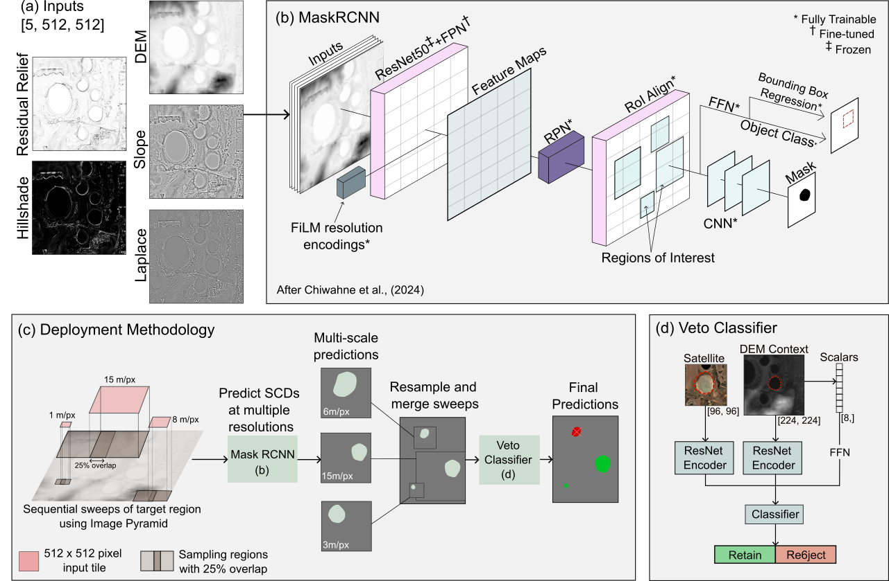

# Automatic SCD Detection for Natural Hydrogen Exploration using a Scale-Normalised Mask R-CNN with an Image-Pyramid

Short introductory sentence or two

## Repository Structure

```text
code/
├── deployment/
│   ├── Deployer.py
│   ├── ModelWrapper.py
│   ├── PostProcesser.py
│   └── README.md
├── depreciated/
├── helpers/
│   ├── geostats.py
│   ├── MaskRCNNFunctions.py
│   ├── raster_helpers.py
│   ├── veto_helpers.py
│   └── README.md
├── loaders/
│   ├── ScaleNormalisedDataStack.py
│   ├── VetoDataset.py
│   └── README.md
├── modelling/
│   ├── helpers.py
│   ├── MaskRCNN.py
│   ├── TrainingFunctions.py
│   ├── Veto.py
│   └── README.md
└── notebooks/
    ├── colab/
    ├── field/
    ├── geostats/
    ├── plots/
    └── reproduce.ipynb
```

## Modelling Methods

Predictions of candidate SCDs are generated using the following model architecture and inference strategy.


*Schematic of deep learning methodology for scale-invariant SCD detection: (a)
adapted Mask R-CNN architecture for SCD detection, (b) inference strategy using a Scale-
Normalised Image Pyramid (SNIP) to maximise the receptive field of the inference mech-
anism, (c) DEM and DEM-derivative input channels, (d) architecture of the veto classifier
used to screen candidates. RPN = Regional Proposal Network, FPN = Feature Pyramid
Network, ROI = Region or Interest, FiLM = Feature-Wise Linear Modulation, CNN = Con-
volutional Neural Network, FFN = Feed Forward Network*

## Misc


